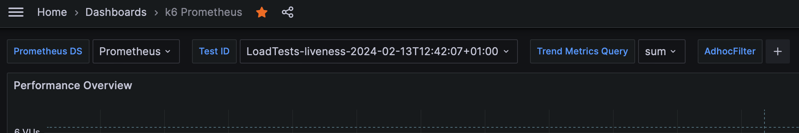

# k6 kubectrl Plugin - Run k6 scripts on a k8s cluster

This plugin allows you to use the [k6 k8s operator](https://github.com/grafana/k6-operator)
more conveniently.

## Installation

### Go

If you have go installed, you can also install the plugin using the following command:

```bash
go install https://github.com/brodo/kubectl-k6@latest
```

## Setup

### k8s
The plugin uses your kube config (generally found under ~/.kube/config) and connects to the cluster
using the currently active k8s context. You can set the context using 
[`kubectl config set-context <context>`](https://kubernetes.io/docs/reference/kubectl/generated/kubectl_config/kubectl_config_set-context/).
You can specify the path to the k8s config file using the [`--k8scfg` flag](docs/index) or the `KUBECONFIG` environment
variable.

### Prometheus
`k6` needs to know which Prometheus server it should send the metrics to. 
Two k6 environment variables control this behavior:

- K6_PROMETHEUS_RW_SERVER_URL
- K6_PROMETHEUS_RW_TREND_STATS 

You **need to be set these**, and there are three ways to do this in k6k8s:

1. Using the `--env` flag: `kubectl k6 run myScript.js --env 'K6_PROMETHEUS_RW_SERVER_URL=http://my.prometheus.svc.cluster.local:9090/api/v1/write,K6_PROMETHEUS_RW_TREND_STATS="p(95),p(99),min,max,avg,count,sum"'`
2. Using a config file. The plugin will look for a file called `.k6k8s.yml` in the current directory. You can also use the [`--cfg` flag](docs/index). Here is an example `.k6k8s.yml`:
    ```yml
    env:
      K6_PROMETHEUS_RW_SERVER_URL: http://my.prometheus.svc.cluster.local:9090/api/v1/write
      K6_PROMETHEUS_RW_TREND_STATS: p(95),p(99),min,max,avg,count,sum
    ```
3. Using an env variable: `K6K8S_ENV='K6_PROMETHEUS_RW_SERVER_URL=http://my.prometheus.svc.cluster.local:9090/api/v1/write,"K6_PROMETHEUS_RW_TREND_STATS=p(95),p(99),min,max,avg,count,sum"' k8ks run myScript.js` - if your value contains a comma, you need to wrap the key-value-pair in quotes.

You might also want to check out [the k6 Prometheus tutorial](https://k6.io/docs/results-output/real-time/prometheus-remote-write/).

## Running the plugin

If you have a valid k8s config, have selected the proper context, and have set up the k6 environment variables, you can
run a script on the cluster using the following command:

```bash
kubectl k6 run myScript.js
```

This command will upload your script as a config map and run it. It will use the current k8s context and the default
namespace called "k6-operator-system."

**The plugin will stop when a test runs for longer than an hour.**

## Configuration

The plugin can be configured using environment variables, command line arguments, and the .k6k8s.yml config file.

### k6 Arguments

The plugin can provide command line arguments to k6.

| Set k6 Arguments     |                                    |
|----------------------|------------------------------------|
| CLI Argument         | `--arguments` (`-a`)               |
| Environment Variable | `K6K8S_ARGUMENTS`                  |
| Configuration File   | `arguments` (string)               |
| Default Value        | `--out experimental-prometheus-rw` |

#### Examples

1. CLI Argument:
    ```bash
    kubectl k6 run myScript.js --arguments '--out experimental-prometheus-rw'
    ```
2. Environment variable:
   ```bash
   export K6K8S_ARGUMENTS='--out experimental-prometheus-rw'
   kubectl k6 run myScript.js
   ```
3. `.k6k8s.yml` configuration file:
   ```yaml
   arguments: --out experimental-prometheus-rw
   ```

### k6 Environment

The Plugin can run k6 with certain environment variables.

| Set k6 Environment   |                |
|----------------------|----------------|
| CLI Argument         | `--env` (`-e`) |
| Environment Variable | K6K8S_ENV      |
| Configuration File   | `env` (object) |
| Default Value        | empty object   |

#### Examples

1. CLI argument:
    ```bash
    kubectl k6 run myScript.js --env 'K6_BATCH=30,K6_HTTP_DEBUG=true'
    ```

2. Environment variable:
   ```bash
   export K6K8S_ARGUMENTS='K6_BATCH=30,K6_HTTP_DEBUG=true'
   kubectl k6 run myScript.js
   ```
3. `.k6k8s.yml` configuration file:
   ```yaml
   env:
      K6_BATCH: 30
      K6_HTTP_DEBUG: true
   ```

### OCI Image

If you use extensions, you need to provide an OCI image that contains a k6 version that was built with them. You can
specify the k6 image which should be used.

| Set OCI Image        |                  |
|----------------------|------------------|
| CLI Argument         | `--image` (`-i`) |
| Environment Variable | K6K8S_IMAGE      |
| Configuration File   | `image` (string) |
| Default Value        | empty string     |

1. CLI argument:
    ```bash
    kubectl k6 run myScript.js --image 'example.com/k6-image:latest'
    ```

2. Environment variable:
   ```bash
   export K6K8S_IMAGE='example.com/k6-image:latest'
   kubectl k6 run myScript.js
   ```
3. `.k6k8s.yml` configuration file:
   ```yaml
   image: example.com/k6-image:latest
   ```

### Image Pull Secret

If your k8s cluster needs an image pull secret to pull the image, you can provide the name of that secret here.

| Set Image Pull Secret |                |
|-----------------------|----------------|
| CLI Argument          | `--ips` (`-s`) |
| Environment Variable  | K6K8S_IPS      |
| Configuration File    | `ips` (string) |
| Default Value         | `ifm-jfrog`    |

1. CLI argument:
    ```bash
    kubectl k6 run myScript.js --ips 'jfrog-secret'
    ```

2. Environment variable:
   ```bash
   export K6K8S_IPS='jfrog-secret'
   kubectl k6 run myScript.js
   ```
3. `.k6k8s.yml` configuration file:
   ```yaml
   ips: jfrog-secret
   ```

### Parallelism

The k6 operator can run tests on multiple pods at once. **The 'parallelism' argument cannot be larger than maximum VUs
in the script.**

| Set Parallelism      |                         |
|----------------------|-------------------------|
| CLI Argument         | `--parallelism` (`-p`)  |
| Environment Variable | K6K8S_PARALLELISM       |
| Configuration File   | `parallelism` (integer) |
| Default Value        | 1                       |

#### Examples

1. the `--parallelism` (`-p`) cli argument:
    ```bash
    kubectl k6 run myScript.js --parallelism 2
    ```

2. The `K6K8S_PARALLELISM` environment variable:
   ```bash
   export K6K8S_PARALLELISM='2'
   kubectl k6 run myScript.js
   ```
3. The `.k6k8s.yml` configuration file:
   ```yaml
   parallelism: 2
   ```

### Example Configuration file

```yaml
arguments: --out experimental-prometheus-rw
env:
   K6_PROMETHEUS_RW_SERVER_URL: http://prom-prometheus.monitoring.svc.cluster.local:9090/api/v1/write
   K6_PROMETHEUS_RW_TREND_STATS: p(95),p(99),min,max,avg,count,sum
image: example.com/my-k6:latest
ips: repo-secret
parallelism: 5
```
### Test IDs

The test ID is - as the name suggests - an ID that identifies a single test run. In the Grafana k6 dashboard, you can select a test ID to view results from that test specifically.



**Please always set a test id, eiter in the test itself or using the `--arguments` flag.** 

For example:
```
kubectl k6 run myScript.js --arguments '--tag testid=MyTest-2024-05-03'
```

You can add the current time to the test id like this:
```
kubectl k6 run myScript.js --arguments '--tag testid=MyScript-{{.Time.Format .FormatRFC3339}}'
```


### Parallelism
You can run k6 on multiple pods in parallel using the `--parallelism` flag. This will create a new pod for each k6 run. **The 'parallelism' argument cannot be larger than maximum VUs in the script.**

### k6 Extensions & Custom Images

To use k6 extensions, you need to provide a custom OCI image that is accessible to the k8s cluster. You can pass the `--image` flag to the run command to specify the image tag. 
The plugin will then use this image to run the k6 script.


### Bundling & TypeScript

The plugin uses [esbuild](https://esbuild.github.io) to bundle and minify all the scripts you want to run and uploads the
bundle as a ConfigMap to the k8s cluster. This means that you need to use `import` statements to include other 
files in your main script:

 ```javascript
import { myFunction } from './myFunction.js';
import data from './data.json' with { type: 'json' };
 ```

k6 itself does not support TypeScript, but k6k8s transpiles TypeScript to JavaScript in the bundling step.

### Template Variables

The arguments, the environment, and the configuration file support Go templates. 

The plugin provides the following template variables:

- Cwd: The current working directory
- RunId: The unique ID of the test run. Twenty characters long and alphanumeric. The RunId is not the test ID.
- Script: The name of the script file
- ScriptDir: The directory the script is in.
- ScriptPath: The complete path you provided as an argument to k6k8
- ScriptWOExt: The name of the script without the extension
- ScriptWOExtKebab: The name of the script without the extension, but in kebab-case
- Time: The time when the plugin started. This variable is not a string and needs to be formatted in one of the ways described below.
 
For example, if you run the program like this: `kubectl k6 run myproject/loadTests/myTest.js`
inside a directory called `MyProject` this is what the variables will look like:

- Cwd: `MyProject`
- RunId: l4q5ph7vsplt2pxkkv4l (this will change each time you run k6k8s)
- Script: `myTest.js`
- ScriptDir: `loadTests`
- ScriptPath: `myproject/loadTests/myTest.js`
- ScriptWOExt: `myTest`
- ScriptWOExtKebab: `my-test`
- Time: depends on the current time and formatting; see below

### Formatting Time

You can format `.Time` by calling its `Format` method like this: `{{.Time.Format .<format string>}}.
The plugin provides three predefined format strings:

- FormatRFC3339: "2006-01-02T15:04:05Z07:00"
- FormatTimeOnly: "15:04:05"
- FormatANSIC: "Mon Jan _2 15:04:05 2006"

[The Go documentation](https://pkg.go.dev/time#pkg-constants) provides additional information on time formatting.


